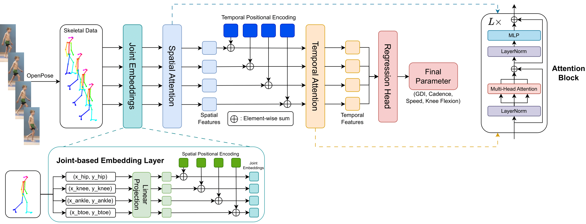

# Learning to Estimate Critical Gait Parameters from Single-View RGB Videos with Transformer-Based Attention Network

This repository is the official implementation for [Learning to Estimate Critical Gait Parameters from Single-View RGB Videos with Transformer-Based Attention Network](https://arxiv.org/pdf/2312.00398.pdf). In this paper, we propose a novel spatio-temporal Transformer network to estimate critical gait parameters (walking speed, cadence, Gait Deviation Index, knee flexion angle at maximum extension) from RGB videos captured by a single-view camera.

## Architecture Overview
<p align="center">  </p>

This figure demonstrates the overall architecture of our proposed method for $T=4$. We first project the 2D coordinates of each joint to a $D$-dimensional space. Our architecture has two attention blocks: spatial and temporal attention block. The spatial attention block extracts spatial information by attending to every other joint in the same frame. The temporal attention block captures temporal dependencies among the frames given a motion sequence. Lastly, we use a Fully Connected Neural Network to output the final parameters.

## Dataset
The dataset used in this study is available [here](https://simtk.org/frs/?group_id=1918). For pre-processed data, [click here](https://kaggle.com/datasets/a6654d7a2e972aa8ba81a25043e19c8a82931313784739c8145b53bc5a432d24), which has been pre-processed following the official code of [mobile-gaitlab](https://github.com/stanfordnmbl/mobile-gaitlab). 

You can download our pre-processed data and create a new directory `data` to start training.

## Training
To train the model, run:
* For GDI:
```bash
python main.py --epoch_num 200 --batch_size 128 --lr 3e-4 --eta_min 8e-5 --target_metric GDI --sides 2
``` 
* For Knee Flexion Angle at Maximum Extension:
```bash
python main.py --epoch_num 200 --batch_size 128 --lr 3e-4 --eta_min 8e-5 --target_metric KFME --sides 2
``` 
* For Speed:
```bash
python main.py --epoch_num 200 --batch_size 128 --lr 6e-4 --eta_min 1e-4 --target_metric speed --sides 1
``` 
* For Cadence:
```bash
python main.py --epoch_num 200 --batch_size 128 --lr 6e-4 --eta_min 1e-4 --target_metric cadence --sides 1
``` 
`-sides` controls the number of sides to train the model. Double-sided parameters, such as GDI or Knee Flexion Angle at Maximum Extension, require the model to output one metric for each side.

`-eta_min` controls the minimum learning rate for the CosineAnnealingWarmRestarts scheduler as proposed in [SGDR: Stochastic Gradient Descent with Warm Restarts](https://arxiv.org/pdf/1608.03983.pdf)

## Acknowledgment
We would like to thank the authors of [PoseFormer](https://github.com/zczcwh/PoseFormer) and [mobile-gaitlab](https://github.com/stanfordnmbl/mobile-gaitlab). Part of our implementation is adapted from their open-source code.